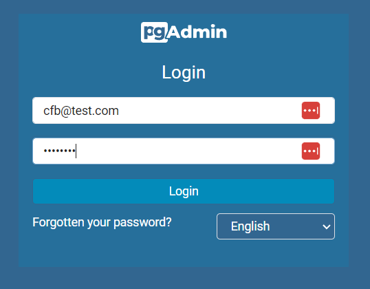
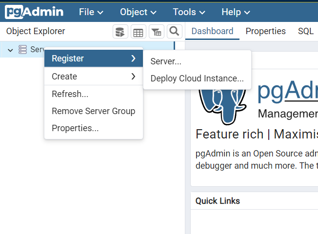
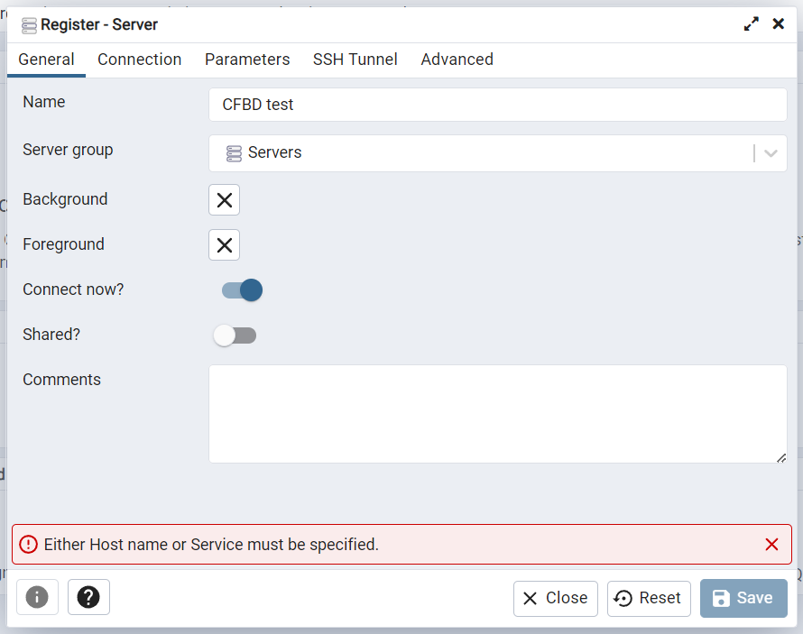
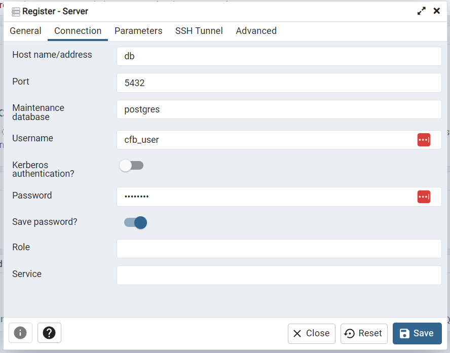
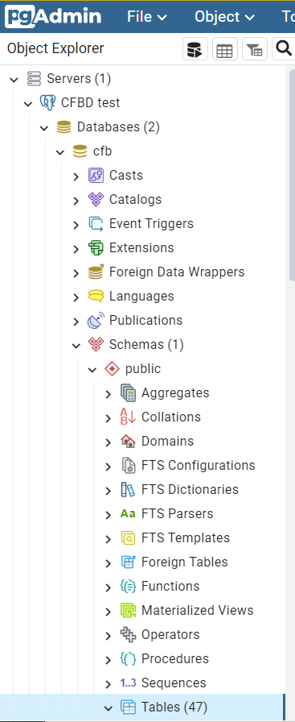
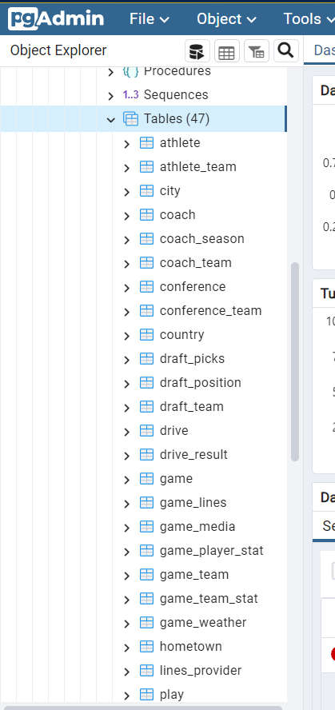

# CFBD Test Database

## How to use this repo

This repo contains a schema dump of the official CFBD database as of 8/9/2023. Only a select few smaller tables containing more static type data are populated. Use this repo to spin up a test database if you would like to:

- Test changes for submitting a pull request off of the [cfb-api](https://github.com/CFBD/cfb-api) repo
- Submit data changes or fixes in the format of the actual schema to streamline getting them included
- Submit a SQL script for fixing or cleaning up data

## Instructions

A [docker-compose](https://docs.docker.com/compose/) configuration is included. This will automatically spin up a PostgreSQL instance, create a database from the schema dump, and spin up a local instance of [pgAdmin](https://www.pgadmin.org/) that you can use to connect to the database.

**Prerequisites:** You must have [Docker](https://docs.docker.com/engine/install/) installed. If running on Windows, the WSL2 backend is highly recommended.

Run the following commands to clone the repo and spin up the Docker containers.

    git clone git@github.com:CFBD/cfb-test-database.git
    docker-compose up

And that's literally it.

## Using pgAdmin

1. In your browser, navigate to http://localhost:5050
2. Log into pgAdmin. If you made now modification to the `docker-compose.yml` file, the default username is `cfb@test.com` with a password of `testpass`

3. On the left sidebar, right-click on "Servers" and select "Register" > "Server..."

4. In the menu window that pops up, in the 'General' tab, enter a database server name. ('CFBD Test' in the image below)

5. In the 'Connection' tab, enter a 'Host name/address' of `db`, a 'Username' of `cfb_user`, and a 'Password' of `testpass` (assuming you haven't modified `docker-compose.yml`). Click to enable "Save password?".

6. Click 'Save'

You have successfully configured pgAdmin to connect to the test CFBD database. You could now be able to inspect the schema, load data, run scripts, etc.

